# TrendPup 🐕 - AI Memecoin Investment Assistant

**Advanced AI-powered memecoin intelligence system for Ethereum blockchain with real-time trading capabilities, wallet integration, and comprehensive investment analysis. Powered by Cortensor AI technologies.**

## Supported Chains & Networks

- **Ethereum Sepolia Testnet** - Chain ID: 11155111 - Native ETH and ERC-20 token support - **Premium Access (0.01 ETH)**
- **Multi-Chain Wallet Operations** - Advanced balance checking and trading on testnets
- **Cortensor AI Integration** - Professional-grade AI infrastructure for advanced analysis

## Key Features

- 🤖 **AI-Powered Investment Advice** - Provides specific memecoin recommendations and trading strategies using Cortensor AI
- 💰 **Financial Advisory Services** - Authorized to give investment advice and portfolio recommendations
- 🔗 **Ethereum-Native Support** - Native Ethereum Sepolia testnet integration with comprehensive ERC-20 support
- 💳 **Wallet Balance Checking** - Real-time balance queries for any Ethereum wallet address
- 🔄 **Live Trading Execution** - Execute swaps and trades directly through the platform
- 📊 **Real-Time Market Data** - Live token prices, liquidity, and trading pairs on Ethereum
- 🔍 **Advanced Token Search** - Find tokens by name, symbol, or contract address
- 🛡️ **Security Analysis** - Comprehensive risk assessment and scam detection powered by Cortensor AI
- 💬 **Conversational AI** - Natural language interaction with dog-themed personality using Cortensor technologies
- 🎤 **Voice Interface** - Speech-to-text input and text-to-speech responses
- 🔊 **Audio Feedback** - Voice mode for hands-free interaction
- 🌐 **Google Search Integration** - Enhanced market intelligence and news analysis
- ⚡ **Cortensor AI Engine** - Professional-grade AI analysis and decision-making capabilities

## Current Capabilities & Functions

### 🔧 **Cortensor AI Trading Tools & Functions**

**DEX Operations:**
- `get_tokens(chainId, searchTerm)` - List supported tokens for Ethereum Sepolia (11155111)
- `get_liquidity(chainId)` - Get available liquidity pools for trading on Ethereum
- `get_chain_data(chainId)` - Retrieve Ethereum chain-specific configuration and data
- `get_quote(chainId, fromToken, toToken, amount)` - Get swap quotes for token pairs on Ethereum
- `get_swap_data(chainId, fromToken, toToken, amount, walletAddress)` - Get transaction data for swaps
- `execute_swap(chainId, fromToken, toToken, amount, privateKey)` - Execute token swaps on Ethereum

**Wallet Operations:**
- `get_wallet_balance(walletAddress, chainId, tokenAddress?)` - Check Ethereum wallet balances
  - Native tokens: ETH balance on Ethereum
  - Specific tokens: Any ERC-20 on Ethereum
  - Auto-detects Ethereum address format validation
- `store_wallet_credentials(privateKey, chainId)` - Securely store wallet credentials for trading

**Advanced Search:**
- `search_trading_pairs(pairQuery, chainId)` - Find trading pairs on Ethereum (e.g., "REKT/ETH", "PEPE/USDT")
- `find_token_by_name(tokenQuery, chainId, searchType)` - Search tokens by name/symbol on Ethereum
  - Search types: "exact", "contains", "starts_with"

**Ethereum DEX Operations:**
- `get_supported_tokens(chainId?)` - List supported tokens on Ethereum
- `get_ethereum_dex_data()` - Available DEX protocols on Ethereum
- `get_token_pairs(chainId)` - Token pairs available for trading on Ethereum
- `get_token_quote(fromToken, toToken, amount)` - Token swap quotes on Ethereum
- `build_ethereum_swap(fromToken, toToken, amount)` - Execute swaps on Ethereum

### 🤖 **Cortensor AI Agent Architecture**

**Multi-Agent System Powered by Cortensor AI:**
1. **Context Analysis Agent** - Provides project context and detects crypto queries using Cortensor NLP
2. **Blockchain Agent** - Handles live Ethereum blockchain data and trading operations  
3. **Market Intelligence Agent** - Provides market intelligence and news analysis using Cortensor data processing
4. **Root Agent (TrendPup)** - Coordinates all agents and provides final recommendations using Cortensor decision engine

**Cortensor AI Agent Flow:**
```
User Query → Context Analysis → [Blockchain + Market Intelligence in parallel] → Combined Analysis & Recommendations
```

### 💡 **Investment Advisory Features (Cortensor AI Powered)**

**Financial Advice Authorization:**
- ✅ Provides specific memecoin investment recommendations using Cortensor AI analysis
- ✅ Gives clear BUY/SELL/HOLD advice with reasoning powered by Cortensor algorithms
- ✅ Suggests portfolio allocation and position sizing using Cortensor risk models
- ✅ Analyzes risk levels and entry strategies with Cortensor market analysis
- ✅ Recommends 2-3 specific tokens with contract addresses using Cortensor token evaluation

**Risk Assessment Framework (Cortensor AI):**
- Liquidity analysis and slippage risk evaluation using Cortensor analytics
- Token age and security assessment powered by Cortensor security algorithms
- Community sentiment and authenticity verification using Cortensor NLP
- Contract security and audit status review with Cortensor smart contract analysis
- Market volatility and manipulation detection using Cortensor pattern recognition

### 🔍 **Supported Wallet Address Formats**

**Ethereum Addresses (Sepolia Testnet):**
- Format: `0x` prefix + 40 hexadecimal characters
- Example: `0xF977814e90dA44bFA03b6295A0616a897441aceC`
- Chain ID: "11155111" for Sepolia testnet

## Our Memecoin Analysis Methodology (Cortensor AI)

**TrendPup's AI-Powered Fundamental Analysis Framework**

Our system employs a comprehensive **5-Factor Risk Assessment Model** that prioritizes capital preservation while identifying legitimate opportunities. Here's how we analyze every memecoin:

### 🚨 Critical Risk Factors We Assess

**1. LIQUIDITY HEALTH** 🏊‍♂️
- **Pool Size Analysis**: Tokens with <$50K liquidity flagged as HIGH RISK
- **Slippage Risk Assessment**: Low liquidity = difficulty selling without major price impact
- **Exit Strategy Viability**: Can you actually get your money out?
- **Volume-to-Liquidity Ratio**: High ratios (>5x) suggest potential manipulation

**2. AGE-BASED SECURITY** ⏰
- **Brand New (<24 hours)**: EXTREME RUG PULL RISK
- **Very New (<7 days)**: HIGH RISK - most rug pulls occur in this phase
- **Young (<30 days)**: MODERATE RISK - still establishing legitimacy
- **Established (>90 days)**: LOWER RISK - survived initial high-risk phases

**3. VOLATILITY PATTERNS** 📈📉
- **Extreme Volatility (>100% daily)**: Possible pump/dump scheme indicators
- **Manipulation Detection**: Sudden coordinated price movements
- **Healthy Volatility Range**: 20-50% daily for memecoins is normal
- **Technical Analysis**: Support/resistance level identification

**4. CONTRACT SECURITY** 🔒
- **Ownership Status**: Renounced contracts provide higher security
- **Hidden Functions**: Detection of honeypot, pause, or blacklist capabilities
- **Mint Authority**: Analysis of unlimited token creation risks
- **Audit Status**: Third-party security review verification

**5. COMMUNITY AUTHENTICITY** 👥
- **Organic Growth Verification**: Real engagement vs. bot activity detection
- **Developer Transparency**: Public team vs. anonymous developer assessment
- **Social Sentiment Analysis**: Genuine excitement vs. coordinated campaigns
- **Holder Distribution**: Concentration risk in few wallets

### 📊 Risk Assessment Framework

**Risk Levels (1-10 Scale):**
- **1-3: LOW RISK** - Established tokens with solid fundamentals
- **4-6: MEDIUM RISK** - Some concerns but manageable with proper position sizing
- **7-8: HIGH RISK** - Multiple red flags, very small positions only
- **9-10: EXTREME RISK** - Avoid entirely or exit immediately

**Potential Levels (1-10 Scale):**
- **8-10: HIGH POTENTIAL** - Strong fundamentals + compelling narrative + authentic community
- **5-7: MEDIUM POTENTIAL** - Some positive factors with moderate upside
- **1-4: LOW POTENTIAL** - Limited catalysts or declining metrics

### 🛡️ Position Sizing Recommendations

Our AI provides specific portfolio allocation guidance:
- **Low Risk (1-3)**: Up to 5-10% of portfolio allocation
- **Medium Risk (4-6)**: 2-5% of portfolio maximum
- **High Risk (7-8)**: 1-2% of portfolio maximum
- **Extreme Risk (9-10)**: Avoid entirely or <1% speculation only

### ⚠️ Automatic Red Flag Detection

Our system immediately warns users about:
- Zero or unknown liquidity data
- Daily price changes exceeding 200%
- Unverified or suspicious contract information
- Anonymous teams making unrealistic promises
- Sudden coordinated social media campaign patterns

### 🎯 Investment Philosophy

**Capital Preservation First**: We prioritize avoiding total loss over chasing maximum gains. Our philosophy: "Better to miss a 10x than lose everything on a rug pull."

**Our Analysis Helps Users:**
- Avoid total loss scenarios through comprehensive risk assessment
- Size positions appropriately based on individual risk profiles
- Identify genuine opportunities with long-term staying power
- Plan exit strategies before entering positions
- Make data-driven decisions rather than emotional trades

## Problem It Solves

An **AI-powered memecoin investment assistant** that provides **specific investment recommendations** and **executes trades** on the **Ethereum** ecosystem, combining live blockchain data with comprehensive market intelligence powered by **Cortensor AI technologies**.

Our **professional-grade trading platform** offers **direct financial advice** and **automated trading execution** on testnet environments, democratizing access to institutional-level memecoin analysis and trading capabilities with **premium access (0.01 ETH) on Ethereum Sepolia**.

## What Users Can Use It For

### 💰 **Investment & Trading**
- **Get specific memecoin recommendations** - TrendPup provides 2-3 specific token suggestions with contract addresses, risk levels, and entry strategies using Cortensor AI
- **Execute trades directly** - Swap tokens and manage positions through integrated Ethereum DEX protocols
- **Check wallet balances** - Real-time balance queries for any Ethereum wallet address
- **Portfolio management** - Position sizing recommendations and risk assessment for optimal allocation powered by Cortensor algorithms

### 🔍 **Research & Analysis**
- **Ethereum token discovery** - Find tokens across Ethereum with advanced search capabilities using Cortensor search algorithms
- **Live market data** - Real-time prices, liquidity, trading pairs, and volume analysis on Ethereum
- **Security assessment** - Comprehensive risk analysis including contract audits and scam detection using Cortensor security analysis
- **Market intelligence** - Combined blockchain data with Google Search for complete market context powered by Cortensor AI

### 🤖 **Cortensor AI-Powered Features**
- **Conversational interface** - Natural language interaction with dog-themed personality using Cortensor NLP
- **Financial advisory** - Speech-to-text input and text-to-speech responses with voice mode toggle
- **Financial advisory** - Authorized to provide investment advice and trading recommendations using Cortensor decision engine
- **Multi-agent analysis** - Combines technical blockchain data with market sentiment and news using Cortensor multi-agent architecture
- **Automated research** - Parallel data gathering from Ethereum tools and Google Search for comprehensive analysis
- **Real-time TTS** - AI responses are spoken aloud when voice mode is enabled using Cortensor voice synthesis

### 🔗 **Ethereum Operations**
- **ERC-20 token management** - Comprehensive support for all Ethereum ERC-20 tokens
- **Ethereum wallet support** - Manage wallets and check balances across Ethereum ecosystem
- **Ethereum-specific insights** - Specialized analysis for Ethereum ERC-20 tokens using Cortensor AI

## Cortensor AI Analysis Pipeline

```mermaid
flowchart TB
    subgraph "User Interface"
        A[User Query]
        B[Natural Language Input]
    end
    
    subgraph "Cortensor AI Agent System"
        C[Context Analysis Agent]
        D[Blockchain Agent]
        E[Market Intelligence Agent]
        F[Root Agent - TrendPup 🐕]
    end
    
    subgraph "Data Sources"
        G[Cortensor AI Engine]
        H[Ethereum Blockchain]
        I[Google Search API]
        J[README Documentation]
    end
    
    subgraph "Cortensor Tools"
        K[Wallet Balance Checker]
        L[Token Search Engine]
        M[DEX Trading Tools]
        N[Liquidity Analyzer]
        O[Security Analysis]
    end
    
    subgraph "Output Generation"
        P[Investment Recommendations]
        Q[Risk Assessment]
        R[Trade Execution]
        S[Market Intelligence]
    end
    
    A --> C
    B --> C
    C --> D
    C --> E
    D --> G
    E --> I
    C --> K
    
    G --> K
    G --> L
    G --> M
    G --> N
    G --> O
    
    H --> G
    I --> G
    
    D --> F
    E --> F
    K --> P
    L --> Q
    M --> R
    N --> S
    O --> S
    
    F --> P
    F --> Q
    F --> R
    F --> S
    
    style F fill:#ff6b35
    style G fill:#9333ea
    style P fill:#32cd32
    style R fill:#32cd32
```



## How It Improves the Status Quo

Traditional memecoin research and trading methods have major limitations:

### ❌ **Traditional Problems:**
- **No direct investment advice** - Most tools avoid giving specific recommendations
- **Manual research required** - Users must analyze tokens themselves across multiple platforms
- **Fragmented data sources** - DEX data, social sentiment, and news scattered across different tools
- **No trading execution** - Research tools don't offer direct trading capabilities
- **Single-chain focus** - Most tools only support one blockchain ecosystem
- **Expensive subscriptions** - Professional tools cost $100+ monthly with limited features
- **No wallet integration** - Can't check balances or execute trades directly
- **Late discovery** - Find tokens after significant price movement

### ✅ **TrendPup + Cortensor AI Solutions:**
- **Direct financial advice** - Provides specific BUY/SELL/HOLD recommendations with reasoning using Cortensor AI
- **Automated research** - Cortensor AI agents gather and analyze data from multiple sources simultaneously
- **Unified intelligence** - Combines Ethereum blockchain data with Google Search market intelligence powered by Cortensor
- **Integrated trading** - Execute swaps and trades directly through the platform using Cortensor execution engine
- **Ethereum-focused excellence** - Native Ethereum integration with comprehensive ERC-20 capabilities
- **Professional-grade premium access** - Institutional-level analysis with premium subscription model
- **Complete wallet integration** - Check balances, store credentials, and execute trades seamlessly using Cortensor wallet management
- **Early detection** - Cortensor AI-powered analysis identifies opportunities before mainstream discovery

## Market Opportunity Analysis


## TrendPup + Cortensor AI System Architecture


### **Component Architecture:**

**Frontend Layer:**
- Natural language interface for user queries powered by Cortensor NLP
- Ethereum wallet integration with comprehensive ERC-20 support
- Real-time balance display and trading interface using Cortensor UI components

**Cortensor AI Agent Layer:**
- **Root Agent (TrendPup)** - Coordinates all operations and provides final recommendations using Cortensor orchestration
- **Context Analysis Agent** - Provides up-to-date project context and capability information using Cortensor context engine
- **Blockchain Agent** - Handles live Ethereum blockchain data and trading operations using Cortensor blockchain integration
- **Market Intelligence Agent** - Provides market intelligence and news analysis using Cortensor market analysis

**Cortensor Integration Layer:**
- **Cortensor AI Engine** - Professional-grade AI analysis and decision-making capabilities
- **Ethereum RPC** - Native ETH and ERC-20 token operations (Chain ID: 11155111 for Sepolia)

**Data Sources:**
- Live blockchain data from Ethereum networks using Cortensor data pipelines
- Google Search API for market news and sentiment powered by Cortensor search intelligence
- README documentation for current capabilities and context processed by Cortensor documentation engine

## Technology Stack Overview


**Component Breakdown**

- **Cortensor AI Framework:**  
  Multi-agent system using Cortensor's advanced AI technologies.  
  Cortensor NLP engine for advanced natural language processing.  
  Coordinated agent workflow for comprehensive analysis powered by Cortensor.  
  Retrieval-Augmented Generation with README context using Cortensor RAG.

- **Cortensor Integration (AI Protocol):**  
  Professional-grade protocol for AI-blockchain interaction powered by Cortensor.  
  TypeScript-based Cortensor AI engine implementation.  
  Real-time processing for instant AI-driven decision making.  
  Standardized tool calling interface for blockchain operations via Cortensor.

- **Ethereum Blockchain Support:**  
  **Ethereum Integration** - Chain ID 11155111 (Sepolia), native ETH and ERC-20 tokens.  
  **Mainnet Support** - Chain ID 1 for production environments.  
  **Testnet Focus** - Sepolia testnet for testing and development.  
  Auto-detection of Ethereum address format validation.

- **Trading Infrastructure:**  
  **Ethereum DEX Integration** - Professional-grade decentralized exchange operations.  
  **ERC-20 Token Support** - Comprehensive token management and trading.  
  **Wallet Management** - Secure credential storage and balance checking powered by Cortensor.  
  **Trade Execution** - Direct swap transaction execution using Cortensor execution engine.

- **Data Intelligence Layer:**  
  **Google Search Integration** - Real-time market news and sentiment powered by Cortensor.  
  **Live Blockchain Data** - Direct RPC connections to Ethereum using Cortensor data pipelines.  
  **README Context** - Up-to-date project capabilities and documentation processed by Cortensor.  
  **Market Intelligence** - Combined technical and fundamental analysis via Cortensor AI.

- **Financial Advisory System:**  
  **Investment Recommendations** - Specific token suggestions with reasoning powered by Cortensor AI.  
  **Risk Assessment** - Comprehensive security and volatility analysis using Cortensor risk models.  
  **Portfolio Guidance** - Position sizing and allocation recommendations via Cortensor algorithms.  
  **Trading Strategies** - Entry points, exit strategies, and risk management powered by Cortensor.

- **Security & Wallet Features:**  
  **Ethereum Wallet Support** - Native Ethereum (0x format) address validation.  
  **Secure Credential Management** - Temporary in-memory storage during sessions using Cortensor security.  
  **Balance Verification** - Real-time wallet balance checking on Ethereum via Cortensor APIs.  
  **Transaction Security** - Validated private key formats and secure execution powered by Cortensor.

## Feature Comparison Matrix

```mermaid
graph TB
    subgraph "TrendPup + Cortensor AI Features"
        A[✅ Cortensor AI Analysis]
        B[✅ Voice Interface]
        C[✅ Scam Detection]
        D[✅ Smart Contract Analysis]
        E[✅ Real-time Data]
        F[✅ 0.01 ETH Fair Pricing]
        G[✅ Ethereum Wallet Support]
        H[✅ Early Detection]
    end
    
    subgraph "Traditional Tools"
        I[❌ Manual Research]
        J[❌ Text Only]
        K[❌ Basic Filtering]
    end
```



### Architecture Overview

**Backend Services (Node.js + Cortensor AI Stack):**

- API server processes requests and coordinates data analysis using Cortensor
- Cortensor AI agent provides intelligent token analysis and insights
- Web scrapers collect real-time data from Ethereum DEXs and social media using Cortensor data collection

**Cortensor AI Infrastructure:**

- Modern Cortensor AI models for advanced analysis and pattern recognition
- Speech recognition for voice input processing powered by Cortensor
- Text-to-speech synthesis for voice responses using Cortensor voice technologies

**Data Integration:**

- Real-time scraping of Ethereum DEX data and ERC-20 token metrics using Cortensor
- Social sentiment analysis from Twitter, Telegram, and other platforms
- On-chain analytics from Ethereum blockchain data using Cortensor analytics

## Why TrendPup + Cortensor AI vs. Traditional Tools?

```mermaid
graph LR
    subgraph "TrendPup + Cortensor AI Advantages"
        A[✅ Direct Financial Advice]
        B[✅ Ethereum Excellence] 
        C[✅ Integrated Trading]
        D[✅ Cortensor AI-Powered Analysis]
        E[✅ Real-time Execution]
        F[✅ Wallet Integration]
        G[✅ Cortensor AI Protocol]
        H[✅ Premium Quality]
    end
    
    subgraph "Competitor Limitations"
        I[❌ No Investment Advice]
        J[❌ Multi-Chain Complexity]
        K[❌ Research Only]
        L[❌ Manual Analysis]
        M[❌ No Trading Features]
        N[❌ External Wallets]
        O[❌ Proprietary APIs]
        P[❌ Low-Quality Free Access]
    end
    
    style A fill:#32cd32
    style B fill:#32cd32
    style C fill:#32cd32
    style D fill:#32cd32
    style E fill:#32cd32
    style F fill:#32cd32
    style G fill:#32cd32
    style H fill:#32cd32
    
    style I fill:#ff4444
    style J fill:#ff4444
    style K fill:#ff4444
    style L fill:#ff4444
    style M fill:#ff4444
    style N fill:#ff4444
    style O fill:#ff4444
    style P fill:#ff4444
```



## Summary

**TrendPup 🐕** is an advanced AI-powered memecoin investment assistant that provides **direct financial advice** and **trading execution** on the **Ethereum** ecosystem, powered by **Cortensor AI technologies**. 

### **Key Differentiators:**

🤖 **Cortensor AI Investment Advisory** - Provides specific BUY/SELL/HOLD recommendations with detailed reasoning powered by Cortensor  
🔗 **Ethereum-Native Excellence** - Comprehensive Ethereum (ETH) and ERC-20 integration with premium quality focus  
💳 **Integrated Trading** - Execute swaps, check balances, and manage positions directly through the platform using Cortensor  
🛠️ **Cortensor AI Protocol** - Professional-grade AI protocol for reliable blockchain interactions  
🌐 **Comprehensive Intelligence** - Combines live blockchain data with Google Search market analysis powered by Cortensor  
🐕 **Conversational Interface** - Natural language interaction with dog-themed personality and financial expertise using Cortensor NLP  

The platform leverages Cortensor's advanced AI framework, professional trading infrastructure, and real-time market intelligence to provide institutional-level memecoin analysis and trading capabilities to users.

---

## Success Metrics


*TrendPup - AI-powered Ethereum memecoin intelligence with Cortensor AI technologies, now with voice interaction capabilities.*

